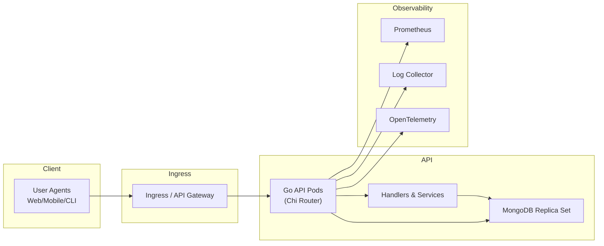

# Task API

A RESTful task management API built with Go and MongoDB.

## Features

- JWT-based authentication
- CRUD operations for tasks
- Pagination and filtering
- Soft delete functionality
- Health checks
- Docker support

## Architecture




## Quick Start

### Using Docker Compose

```bash
docker compose up --build
```

### Local Development

1. Install MongoDB:
```bash
brew install mongodb-community@7.0
brew services start mongodb-community@7.0
```

2. Set environment variables:
```bash
export TASKAPI_DATABASE_URI="mongodb://localhost:27017"
export TASKAPI_JWT_SECRET="your_secret_key"
```

3. Run the server:
```bash
go run cmd/server/main.go
```

## API Usage

### Login (get JWT token)
```bash
curl -X POST http://localhost:8080/v1/login \
  -H "Content-Type: application/json" \
  -d '{"email":"admin@example.com","password":"admin123"}'
```

### Create a task
```bash
curl -X POST http://localhost:8080/v1/tasks \
  -H "Authorization: Bearer <token>" \
  -H "Content-Type: application/json" \
  -d '{"title":"Sample Task","description":"Task description","status":"open"}'
```

### List tasks
```bash
curl -X GET http://localhost:8080/v1/tasks \
  -H "Authorization: Bearer <token>"
```

### Health check
```bash
curl http://localhost:8080/healthz
```

## Environment Variables

- `TASKAPI_SERVER_PORT`: Server port (default: 8080)
- `TASKAPI_DATABASE_URI`: MongoDB connection string
- `TASKAPI_DATABASE_DATABASE`: Database name (default: taskdb)
- `TASKAPI_JWT_SECRET`: JWT signing secret
- `TASKAPI_JWT_EXPIRY_HOURS`: Token expiry in hours (default: 24)
